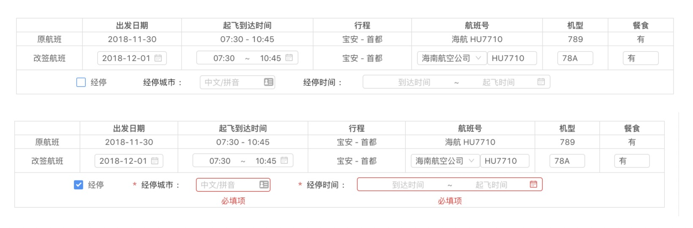

# 复杂表单验证

## 使用场景

当一组表单的验证状态会反复变更的时候，使用 Angular 内置的 form valid 会变得极为繁琐，如下图所示：

- 当未勾选经停的时候，经停城市 和 经停时间都是非必填项，在整个表单 submit 的时候不用去校验它的状态。
- 当已勾选经停的时候，经停城市 和 经停时间变为必填项，需要做到 required 标识的添加，验证错误提示，以及整个表单 submit 时校验状态。



## 解决方案：数据驱动编程

通过定义一个适用于整个表单的 config 数据，此表单的所有状态都由 config 来控制。

- 核心实现 FormValidateUtils

  ```typescript
  import { AfterViewInit } from "@angular/core";
  import { FormGroup } from "@angular/forms";
  import { debounceTime, distinctUntilChanged } from "rxjs/operators";

  /**
   * form的配置信息 根据config 对表单进行控制
   */
  export interface FormConfig {
    [key: string]: {
      default?: any; // 默认值
      disabled?: boolean; // 是否禁用
      required?: boolean; // 是否必填
      hidden?: boolean; // 是否隐藏 (只是隐藏掉，不移除DOM)
      notRender?: boolean; // 是否不进行渲染（移除DOM）
      needValidate?: boolean; // 在元素被禁用，隐藏，或者移除的时候，任需要校验此项 ，则设置为TRUE
      errorMessage?: string; // 错误提示信息
      errorMessageObj?: {
        [key: string]: string; // 错误类型对应的错误提示信息
      };
    };
  }

  export class FormValidateUtils implements AfterViewInit {
    form: FormGroup;
    formConfig: FormConfig;

    // 默认错误提示信息
    private defaultErrorMsgObj: { [key: string]: string } = {
      required: "必填项",
      pattern: "格式不正确"
    };

    constructor() {}

    /**
     * 订阅表单值改变事件
     *
     * 在 form 首次初始化完成后 subscribe
     * 否则有可能在初始化过程中 发生改变 从而显示提示信息 影响用户体验
     */
    ngAfterViewInit(): void {
      this.form.valueChanges
        .pipe(
          debounceTime(300),
          distinctUntilChanged()
        )
        .subscribe(_ => this.validateForm());
    }

    /**
     * 表单验证
     *
     * 根据 formConfig 中的配置进行验证 修改提示信息并返回验证结果
     *
     * @param isSubmit 是否是提交时候的校验 若是, 跳过dirty 并将 control 的状态设置为 touched 以及更新 control 的状态
     */
    validateForm(isSubmit?: boolean): boolean {
      let result = true;
      Object.keys(this.formConfig).forEach(field => {
        const fieldConfig = this.formConfig[field];
        const control = this.form.get(field);
        if (
          (fieldConfig.needValidate ||
            (!fieldConfig.notRender &&
              !fieldConfig.disabled &&
              !fieldConfig.hidden)) &&
          control &&
          (isSubmit || control.dirty) &&
          control.invalid
        ) {
          if (isSubmit) {
            control.markAsTouched();
            control.updateValueAndValidity({
              onlySelf: true // 只更新自己 不更新父组件
            });
          }
          /**
           * 根据 errorKey 按
           *  1 fieldConfig.errorMessageObj
           *  2 this.defaultErrorMsgObj
           *  3 control.errors[errorKey]
           * 的顺序设置错误提示信息
           */
          const messageObj = fieldConfig.errorMessageObj || {};
          Object.keys(control.errors).find(errorKey => {
            let message = messageObj[errorKey];
            if (!message) {
              message = this.defaultErrorMsgObj[errorKey];
              if (!message && typeof control.errors[errorKey] === "string") {
                message = control.errors[errorKey];
              }
            }
            fieldConfig.errorMessage = message;
            return !!message;
          });
          result = false;
        } else {
          fieldConfig.errorMessage = "";
        }
      });
      return result;
    }
  }
  ```

- component 如何使用

  ```typescript
  export class ChangeInfoComponent extends FormValidateUtils
    implements OnInit, OnChanges {
    @Input()
    route: FlightOrderRoute;
    segment: FlightOrderSegment;

    // #region FormConfig
    form: FormGroup;
    formConfig: FormConfig = {
      hasStop: {},
      stopCityName: {},
      stopDate: {}
    };

    private get hasStop() {
      return this.form.controls.hasStop;
    }
    private get stopCityName() {
      return this.form.controls.stopCityName;
    }
    private get stopDate() {
      return this.form.controls.stopDate;
    }
    // #endregion

    constructor(private fb: FormBuilder) {
      super();
    }

    ngOnChanges(changes: SimpleChanges): void {
      if (changes["route"] && changes["route"].currentValue) {
        const segment = this.route.segments[0];
        this.segment = segment;
        const formConfig = this.formConfig;
        formConfig.hasStop = { default: segment.stops > 0 };

        if (segment.stops > 0) {
          // 只能写死0
          const stopInfo = segment.stopInfo[0];
          formConfig.stopCityName = { default: stopInfo.city, required: true };
          formConfig.stopDate = {
            default: [stopInfo.arrival, stopInfo.departure],
            required: true
          };
        }
      }
    }

    ngOnInit() {
      this.form = this.initForm();

      this.hasStop.valueChanges.subscribe(value => {
        const formConfig = this.formConfig;
        if (value) {
          formConfig.stopCityName.required = true;
          formConfig.stopDate.required = true;
          this.stopCityName.setValidators(Validators.required);
          this.stopDate.setValidators(Validators.required);
        } else {
          formConfig.stopCityName.required = false;
          formConfig.stopDate.required = false;
          this.stopCityName.clearValidators();
          this.stopDate.clearValidators();
        }
      });
    }

    private initForm() {
      const formConfig = this.formConfig;
      return this.fb.group({
        hasStop: [formConfig.hasStop.default, [Validators.required]],
        stopCityName: [
          formConfig.stopCityName.default,
          formConfig.stopCityName.required ? [Validators.required] : undefined
        ],
        stopDate: [
          formConfig.stopDate.default,
          formConfig.stopDate.required ? [Validators.required] : undefined
        ]
      });
    }
  }
  ```

- Html 中如何控制表单显示

  ```html
  <nz-row nzGutter="24">
    <nz-col nzSpan="2"> </nz-col>
    <nz-col nzSpan="2" style="line-height: 39px;">
      <label nz-checkbox formControlName="hasStop">经停</label>
    </nz-col>
    <nz-col nzSpan="6">
      <nz-form-item>
        <nz-form-label
          nzSpan="10"
          [nzRequired]="formConfig.stopCityName.required"
        >
          经停城市
        </nz-form-label>
        <nz-form-control nzSpan="14">
          <shared-city-picker
            nzSize="small"
            [listCities]="listCities$ | async"
            [groupCities]="groupCities$ | async"
            formControlName="stopCityName"
          >
          </shared-city-picker>
          <ng-container *ngIf="formConfig.stopCityName.errorMessage as message">
            <nz-form-explain>{{ message }}</nz-form-explain>
          </ng-container>
        </nz-form-control>
      </nz-form-item>
    </nz-col>
    <nz-col nzSpan="12">
      <nz-form-item>
        <nz-form-label nzSpan="4" [nzRequired]="formConfig.stopDate.required">
          经停时间
        </nz-form-label>
        <nz-form-control nzSpan="16">
          <nz-range-picker
            [nzShowTime]="{ nzFormat: 'HH:mm' }"
            nzFormat="yyyy-MM-dd HH:mm"
            [nzPlaceHolder]="['到达时间', '起飞时间']"
            nzSize="small"
            formControlName="stopDate"
          >
          </nz-range-picker>
          <ng-container *ngIf="formConfig.stopDate.errorMessage as message">
            <nz-form-explain>{{ message }}</nz-form-explain>
          </ng-container>
        </nz-form-control>
      </nz-form-item>
    </nz-col>
  </nz-row>
  ```

## 待解决的问题

- form: FormGroup formConfig: FormConfig 是写死的两个变量名称，要使用 FormValidateUtils 就必须命名成这个名字，不够灵活和优雅。
- 其他问题，期待各位提供改进意见和建议。
